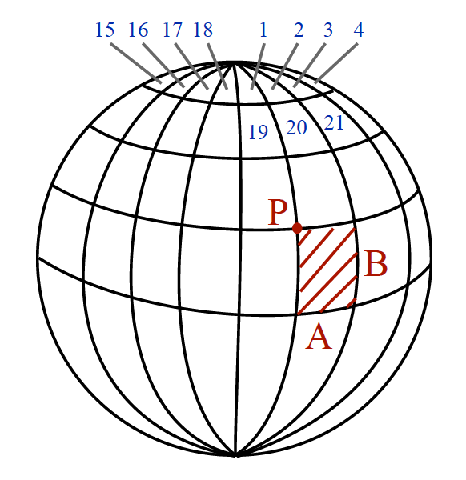
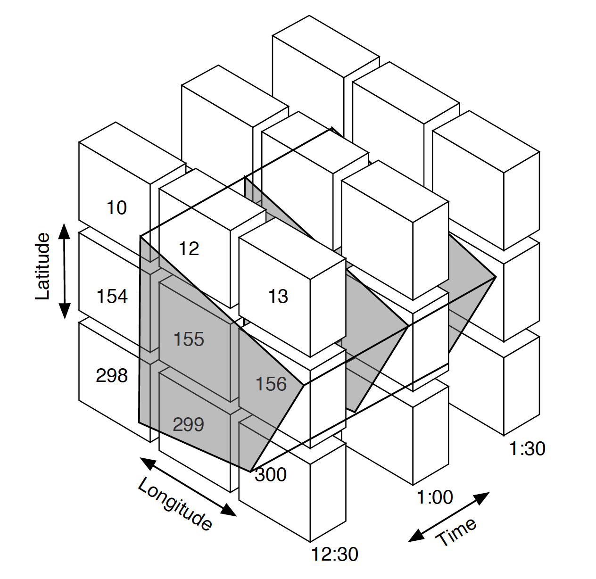

## Data in sensor networks

We monitor conditions on Earth via a vast network of sensors. The sensors
provide the raw measurements of temperature, speed, movement, etc. of the
air, earth, water and environment around us. These measurements feed into
systems that provide us a variety of data sources for making weather
reports, reporting air quality, and even helping to predict earth quakes.

Many of these sensors are connected to the Internet or other network
and report the data from their sensors for a specific location with GPS
coordinates (i.e., latitude and longitude). These reports typically have
a specific timestamp, the coordinates, and a number of readings coded into
some transmission format that the intended receiver will understand. Often,
brevity and compactness often win over usability, interoperability, and
ease of understanding.

The challenge for the receivers is often multifaceted. Sensors are often
attached to some station platform that houses the sensor, provides shelter,
and provides the power and network connectivity to report data. These stations
are somewhere in the world and the receivers are somewhere else and usually
far away.

As the stations are typically small devices, while they may store a small number
of records locally, the usual goal is to transmit the current readings to some
configured endpoint via an API. Once that is accomplished, the data is never
sent again. As such, reports from the source are ephemeral. Once they are
transmitted by the sensor platform, if there is no one to receive them, they
are gone forever.

A typical architecture for large sensor networks has a transport network on
which the sensors transmit their sensor data. This data is received and aggregated
into a data feed. Applications access this data feed via an API, processing and
storing this data for their own purposes. This is shown in the diagram below.

The data feed in this network may have a limited history or may be completely
ephemeral. For example, in the Citizen Weather Observation Program (CWOP), the
aggregated data is transmitted in real-time to whatever connected to the
aggregation server. There is no history of any sensor readings in this case.

Sensor devices are often low-power and low-storage devices and so the main
purpose of the transport network is to receive the sensor readings as fast as
possible to allow the device to discard a the readings and continue operation.
The transport network may have to transcend technologies (e.g., radio to internet
protocols) and typically has little data security around repudiation.

In contrast, the aggregation network may perform some aspects of validation,
consolidation, and storage to provide a cohesive data feed of information. The
main purpose of the aggregation network is to provide a large volume of sensor
readings at a sufficient rate of speed and service-level agreements (SLA) for
the consuming applications. Again, there is no guarantee that an aggregator will
provide a historical record if sensor readings are not stored by receiving
applications.

## A methodology for partitioning data

Geospatial sensor data has two basic facets: location and time. Sensor readings
occur on a particular date and time for the location of the sensor. When
readings are transmitted through the sensor's transport network to the
point of aggregation, they are typically sent along with a timestamp of
collection and the sensor's location (typically, latitude and longitude).

For geospatial data, a partition of the sensor data is a specific area of
interest in both space and time. While we could repeat this partition by
ad hoc queries, a regular partitioning of data by space and time enables
addressable partitions of a reasonable size. At the same time, these kinds of
partitions have desirable architectural characteristics (e.g., caching
or scale-out data storage).

Moreover, regular partitioning also enables regular annotations and naming
principles to be applied to the data resource representations on the web. A
methodology that embraces regular partitions is the
*PAN (Partition, Annotate, and Name) Methodology* [1]. PAN defines a partitioning
of a dataset as:

1. A set of basic facets (e.g., date/time, position) each of which has a
   total ordering whose relation can be used to define the partition.

1. Every partition can be uniquely defined identified by a set of basic facet
   ranges (e.g., `2020-10-06T20:00:00/PT30M`).

1. Data must belongs to one and only one partition.

1. While a particular dataset may be finite, the possible partitions may be
   infinite.

In the specific case of geospatial sensor data, date and time is an simple
facet for partitioning. One can simply pick a duration (e.g., `PT30M`) and
divide each day into regular time periods. For example, each day can be
evenly divided into 30 minute periods and we can label each day with the start
time and duration, ordering from oldest to newest (e.g., `2020-10-06T00:00:00/PT30M`,
`2020-10-06T00:30:00/PT30M`, etc.).

Location poses a slightly more complicated challenge as there is no single
choice for a total ordering. While geohashes are useful in other context, the
requirement here is to uniquely identify a specific range (partition) of
position values. We need to impose a ordering over the global position that
partitions the global to semi-regular surface areas.

One approach is to use map quadrangles of a defined size that cover the globe.
By choosing regular sizes <math><mfenced><mi>A</mi><mi>B</mi></mfenced></math>
that are even divisors of 360°, a globe can be covered with quadrangles which
are progressively more triangular as you approach the poles. Each quadrangle
can be uniquely defined by a position P and the size.

Finally, we can uniquely label each quadrangle from the one pole to the other with a
*Sequence Number*. This sequence number has two useful properties:

1. For a particular point you can calculate the sequence number of the
   containing quadrangle.

1. For a sequence number, you can calculate the extent of the quadrangle.

With these properties and a particular choice for sizes A and B of the quadrangle,
you can calculate a quadrangle covering of any particular region of interest.
This is accomplished by taking the extreme points (e.g., the boundary vertices of
a polygon) and computing their sequence numbers. Because of the total ordering,
we can determine the remaining sequence numbers algorithmically.

Putting this all together, for a region of interest, we can compute the
sequence numbers of the quadrangle covering and traverse a set of partitions by
other facets such as date and time partitions. For example, in the follow we
can address each partition by a particular sequence number and time period range
values (i.e., #1562020-10-06T12:30:00/PT30M, #156, )

## Storing and accessing geospatial data in Redis

Support for geospatial data was added to Redis in the 3.2.0 release in the form
of geospatial sorted sets. Data is stored in a key where the scoring enables
geospatial radius queries. Each member of the set is a position and a value where
the position is specified by latitude and longitude coordinates. The value can
any string data with a maximum limit of 512MB in size.

The

## Testing MathML

<math>
<mi>y</mi>
<mo>=</mo>
<mfrac>
 <mrow>
 <mi>ln</mi>
 <mfenced>
     <mrow>
        <mfrac>
           <mi>x</mi>
           <mi>m</mi>
        </mfrac>
        <mo>-</mo>
        <mi>s</mi>
        <mi>a</mi>
     </mrow>
 </mfenced>
 </mrow>
 <msup>
     <mi>r</mi>
     <mn>2</mn>
 </msup>
</mfrac>
</math>

  

## References

1. Enabling Scientific Data on the Web, R. Alexander Miłowski, Phd Dissertation,
   Institute for Language, Cognition, and Computation, School of Informatics,
   University of Edinburgh, 2014
